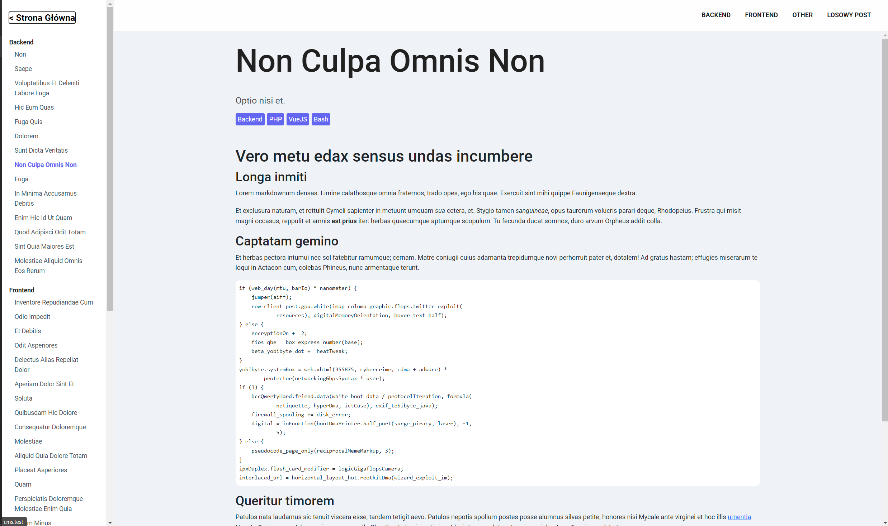
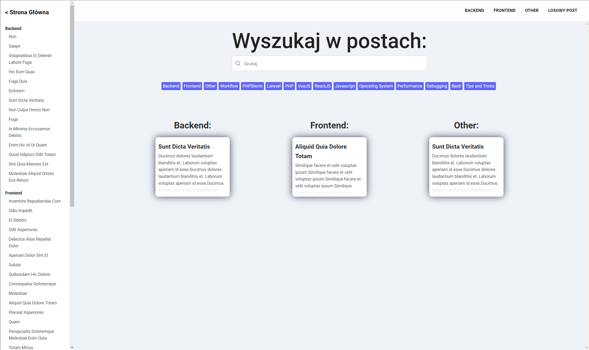
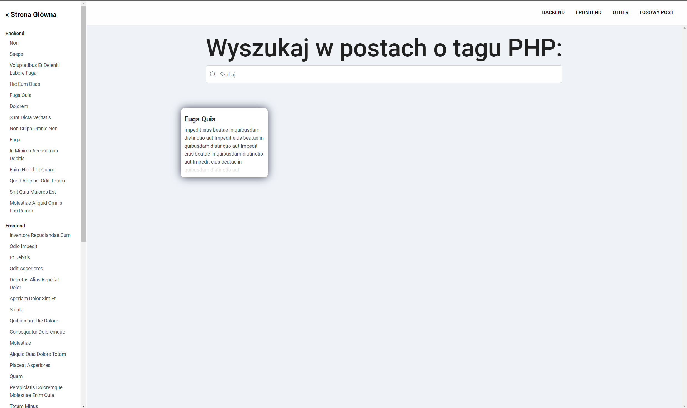
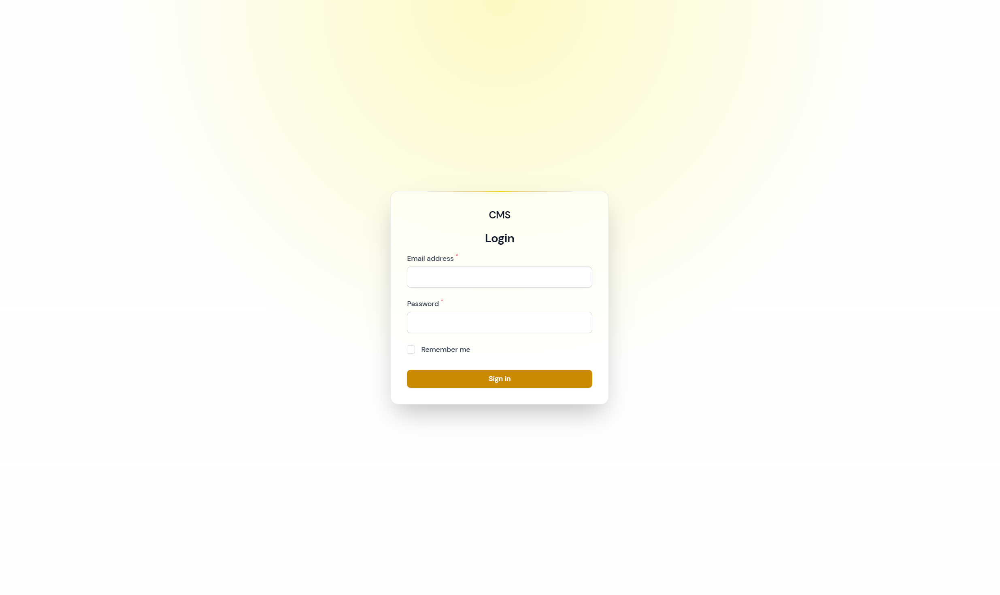
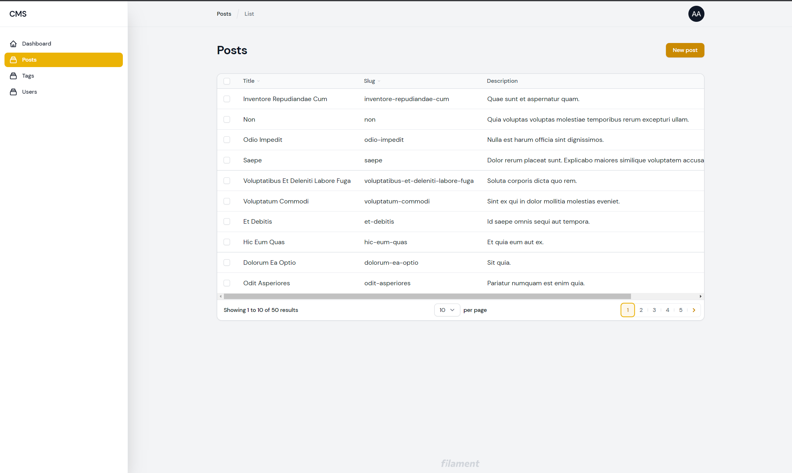
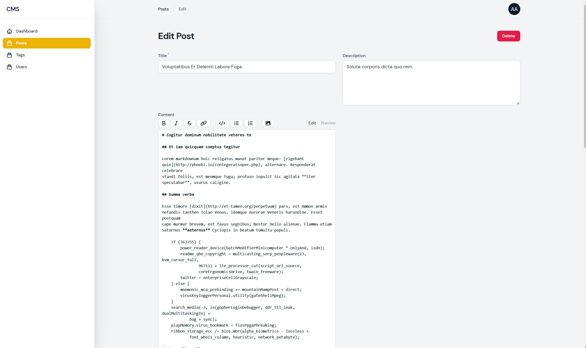
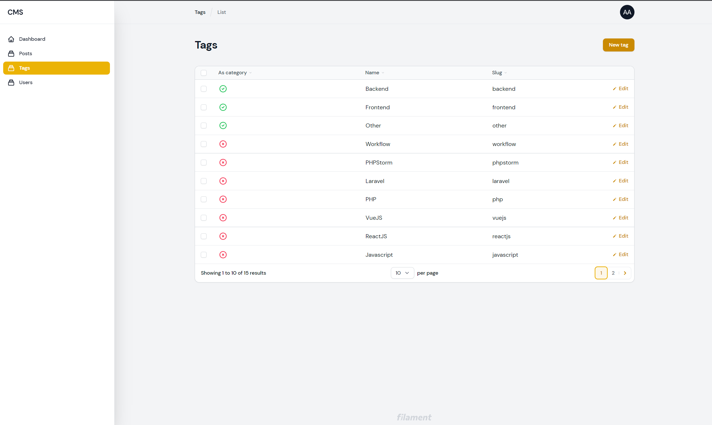
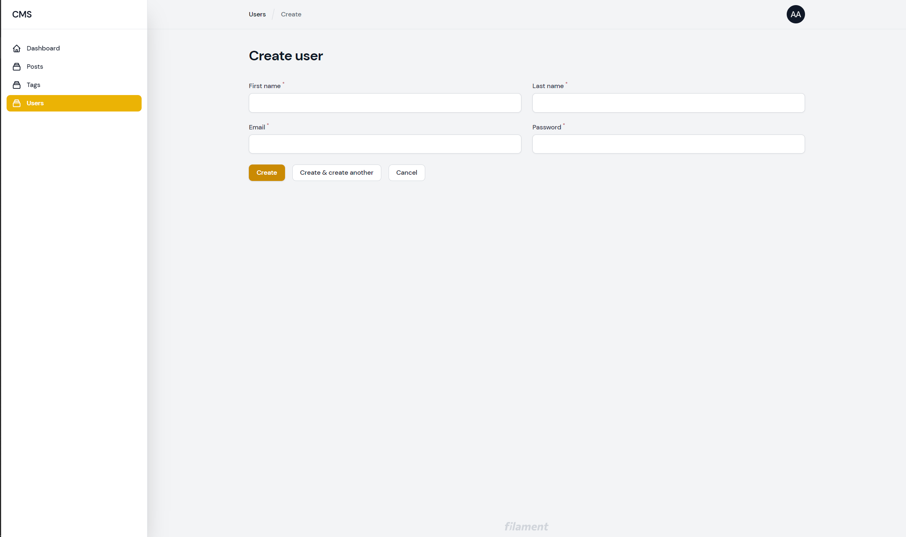

# CMS

Aplikacja na przedmiot Systemy zarządzania Treścią (ZPSB)

## Instalacja

Te instrukcje pozwolą ci na uruchomienie lokalnej kopii aplikacji Premia z plusem

### Wymagania

- Git
- PHP 8.0+
- Composer
- node.js
- npm
- mysql / mariaDB
- (opcjonalnie) Webserver

### Instalacja

Przejdz do folderu, w którym chcesz skonfigurować aplikacje i sklonuj repozytorium

```batch
\> git clone git clone https://github.com/Sagiys/CMS.git .
```

Skopiuj plik konfiguracyjny i go wypełnij

```batch
\project_folder> cp .env.example .env
```

Najważniejszymi danymi na które trzeba zwrócić uwage są

```batch
APP_URL=http://localhost //Ustaw adres aplikacji pod jakim będzie dostępna. Jeżeli korzystasz z domen testowych ustaw domene
                         // w innym przypadku prawdopodobnie wystarczy pełna ścieżka do katalogu public poprzedzona localhost 

DB_CONNECTION=mysql //Driver wykorzystywany przez DB, jeżeli używasz mysql lub mariaDB nie musisz nic zmieniac
DB_HOST=127.0.0.1 //Adres bazy danych
DB_PORT=3306 //Port bazy danych
DB_DATABASE=laravel //Utworzona przez ciebie baza danych wraz z danymi do logowania
DB_USERNAME=root
DB_PASSWORD=
```

Warto wspomnieć, że aplikacja korzysta również z maili. Tutaj jest już pełna dowolność co się podłączy do testów.

Zainstaluj potrzebne paczki

```batch
\project_folder> composer install 
\project_folder> npm install 
```

Zbuduj bazę oraz wygeneruj klucz

```batch
\project_folder> php artisan key:generate 
\project_folder> php artisan migrate:fresh --seed 
```

Zbuduj fronend

```batch
\project_folder> npm run dev
```

Jeżeli korzystasz z webservera możesz ominąć ten krok. Jeżeli jednak go nie posiadasz uruchom serwer

```batch
\project_folder> php artisan serve 
```

Przebudowanie całej bazy

```batch
\project_folder> php artisan migrate:fresh --seed 
```

Automatyczne budowanie frontu

```batch
\project_folder> npm run watch
```

Jednorazowe budowanie frontu

```batch
\project_folder> npm run dev
```

Logowanie do panelu admina

```
https://cms.test/admin/login
User: admin@admin.com
Password: zaq1@WSX
```

## Screen shots










